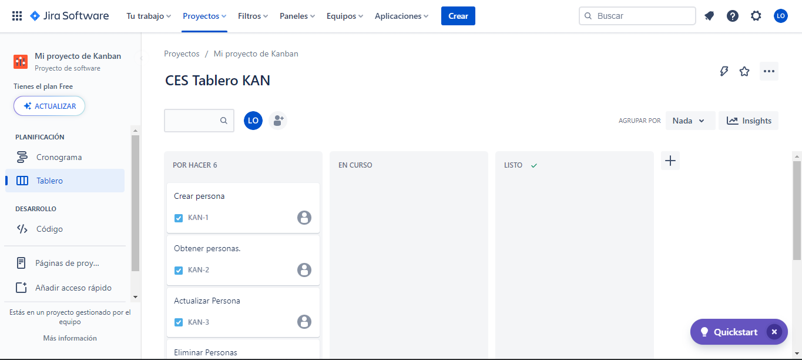
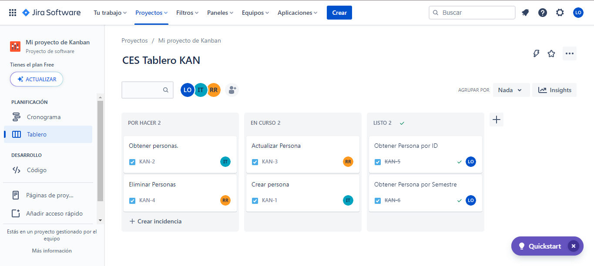
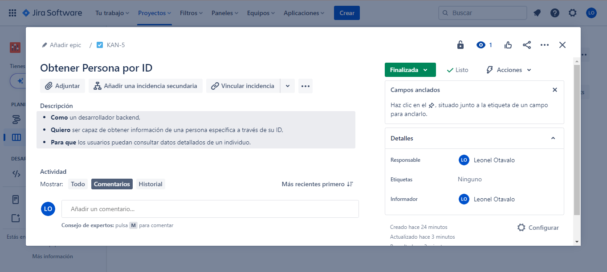

# ESCUELA POLITECNICA NACIONAL

## INGENIERIA DE SOFTWARE

**Asignatura:** Construcción y evolución de software.

#### Integrantes:

- Andy Otavalo
- Rafaela Robalino
- Ismael Toaquiza

# Guía para la Creación de la API de Personas

## Descripción General

Este documento proporciona una guía detallada para desarrollar una API de personas utilizando Flask y Firebase. Esta API permitirá las siguientes operaciones:

- Crear una persona
- Obtener todas las personas
- Actualizar una persona
- Eliminar una persona
- Obtener una persona por ID
- Filtrar personas por semestre

## Pre-requisitos

- Python 3.x instalado
- Acceso a una base de datos Firebase
- Entorno virtual de Python (Opcional pero recomendado)

## Instalación de Dependencias

### Paso 1: Crear un Entorno Virtual (Opcional pero Recomendado)

Primero clonar el repositorio en la maquina local con el siguiente comando:

```bash
git clone https://github.com/leoandy23/Proyecto2B_CES.git
```

Luego, crear un entorno virtual es una buena práctica para aislar las dependencias del proyecto. Para crear uno, ejecute el siguiente comando en la raíz de su proyecto:

```bash
python -m venv venv
```

Para activar el entorno virtual:

- En Windows:

  ```bash
  .\venv\Scripts\Activate
  ```

- En macOS y Linux:

  ```bash
  source venv/bin/activate
  ```

### Paso 2: Instalar Dependencias

Una vez que el entorno virtual está activado (o si eliges no usar uno), puedes instalar las dependencias requeridas.

Ejecute el siguiente comando para instalar las bibliotecas necesarias:

```bash
pip install Flask firebase_admin
```

o también puedes instalar ingresando al directorio API y ejecutanto el siguiente comando para instalar las dependencias desde el documento requirements.txt

```bash
pip install -r requirements.txt
```

Esto instalará Flask, que es un micro marco web para Python, y `firebase_admin`, que es el SDK de administrador de Firebase que te permitirá interactuar con la base de datos Firestore.

### Paso 3: Verificar la Instalación

Para asegurarte de que todas las dependencias se han instalado correctamente, puedes ejecutar el siguiente comando:

```bash
pip freeze
```

Este comando mostrará una lista de todas las bibliotecas instaladas. Asegúrate de que `Flask` y `firebase_admin` aparezcan en la lista.

### Paso 4: Credenciales de Firebase (Opcional)

Si aún no has descargado tu archivo de credenciales de Firebase, asegúrate de hacerlo desde la consola de Firebase y coloca el archivo JSON en un lugar seguro y accesible para tu aplicación.

## Desarrollo

Una vez que las dependencias están instaladas, puedes proceder con el desarrollo de la API. Aquí hay un resumen de los pasos a seguir:

1. Importar las bibliotecas necesarias.
2. Inicializar la aplicación Flask.
3. Conectar con Firebase.
4. Definir las rutas y funciones para manejar las peticiones.

### Creación servidor Flask

```python
from flask import Flask, request, jsonify
import firebase_admin
from firebase_admin import credentials, firestore

app = Flask(__name__)

# Inicialización de Firebase
cred = credentials.Certificate("path/to/serviceAccountKey.json")
firebase_admin.initialize_app(cred)
db = firestore.client()

```

### Creación de rutas

A continuacion se muestra un ejemplo de como crear las rutas de la API.

```python
@app.route('/persons', methods=['GET'])
def get_persons():
    docs = db.collection('persons').stream()
    persons = []
    for doc in docs:
        persons.append(doc.to_dict())
    return jsonify(persons), 200

```

### Ejecución del servidor o la API

Para ejecutar el servidor localmente es posible usar los siguientes comandos en una terminal:

```bash
python app.py
```

## Pruebas

Realiza pruebas unitarias y funcionales para asegurarte de que la API funcione como se espera.

## Despliegue

Después de probar la API, puedes desplegarla en un servidor. Asegúrate de configurar las variables de entorno y las credenciales de Firebase según sea necesario.

---

# Uso de Jira con un Enfoque DevOps para el Desarrollo de la API de Personas

## Introducción

Jira no es solo una herramienta de gestión de proyectos; también se puede utilizar de manera efectiva en un ciclo de vida DevOps para planificar, rastrear y liberar software de alta calidad. Aquí, vamos a describir cómo puedes utilizar Jira para gestionar el desarrollo de una API de personas con un enfoque DevOps.

## Creación del Proyecto en Jira

1. **Acceso y Configuración**: Accede a tu cuenta de Jira y crea un nuevo proyecto. Durante la configuración, selecciona la opción que mejor se adapte a un flujo de trabajo DevOps.

2. **Planificación de Epics y Historias de Usuario**: Al tratarse de una API de personas, debes considerar epics como "Gestión de Usuarios", "Seguridad" y "Despliegue". Bajo estos epics, puedes añadir diversas historias de usuario como "Crear una nueva persona", "Actualizar información de una persona", etc.

## Integración Continua y Entrega Continua (CI/CD)

1. **Vincular Repositorio**: Conecta tu repositorio de código (por ejemplo, GitHub, GitLab, etc.) con Jira para rastrear automáticamente el progreso del código contra las historias de usuario.

2. **Pipelines**: Configura pipelines de CI/CD en Jira para construir, probar y desplegar la API. Esto se puede hacer utilizando herramientas como Jenkins, Bamboo o incluso Jira Pipeline.

## Monitoreo y Retroalimentación

1. **Integrar Herramientas de Monitoreo**: Utiliza plugins o características nativas para integrar Jira con herramientas de monitoreo como Prometheus y Grafana. Esto te ayudará a rastrear el rendimiento de la API en tiempo real.

2. **Feedback Loop**: Configura notificaciones para que cualquier error o incidencia se convierta automáticamente en una nueva historia de usuario o tarea en Jira, facilitando la retroalimentación rápida y la mejora continua.

## Seguimiento y Reportes

- **Dashboard DevOps**: Utiliza el dashboard de Jira para tener una vista unificada del estado de desarrollo, pruebas y despliegue.
- **Gráficos y Métricas**: Jira ofrece varios gráficos que son útiles en un entorno DevOps como gráficos de velocidad, informes de control de calidad, etc.

## Colaboración y Transparencia

- **Comentarios y Documentación**: Mantén todos los detalles, documentos y conversaciones relacionadas con la API en las respectivas historias de usuario en Jira para garantizar que todo el equipo esté alineado.

## Conclusión

La integración de Jira en un entorno DevOps para el desarrollo de la API de personas no solo mejora la planificación y el seguimiento sino que también facilita la automatización, la colaboración y la retroalimentación continua. Este enfoque integral asegura una entrega más rápida y fiable, alineando estrechamente las operaciones de desarrollo y TI.

## Anexos

- Código fuente en GitHub [Enlace al repositorio](https://github.com/leoandy23/Proyecto2B_CES)

- Documentación de la API con Postman [Enlace a la documentación](https://documenter.getpostman.com/view/26000547/2s9YC2zZPZ)

- Uso de la herramienta DevOps Jira
  - Creación de tareas o historias de usuario
    
  - Asignación de las tareas o historias de usuario
    
  - Revisión del estado de las tareas o historias de usuario
    
